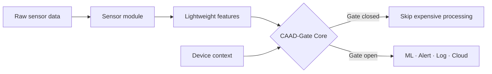

<div align="center">


# CAAD-Gate

### Adaptive Edge Intelligence for Low-Power IoT Devices

**A reusable, context-aware data-gating framework that helps ESP32-class devices decide what data is worth processing.**

[](https://github.com/Thisara-N-Herath/caad-gate)
[](https://www.espressif.com/en/products/socs/esp32)
[](https://www.arduino.cc/)
[](#license)

[Explore the website](index.html) · [Download framework](CAAD-Gate%20V1.zip) · [Read documentation](Read%20Documentation.pdf) · [View source repository](https://github.com/Thisara-N-Herath/caad-gate)

</div>

---

## The idea

Small IoT devices collect a continuous stream of sensor data, but most of it describes normal conditions. Processing every sound frame, movement window, or environmental reading consumes CPU time, memory, battery power, and communication bandwidth.

CAAD-Gate learns normal sensor behaviour locally and opens the gate only when a reading is abnormal, meaningful, or contextually important.

```text
Normal data      →  Gate CLOSED  →  Processing saved
Important event →  Gate OPEN    →  ML, alert, logging, or communication
```

> CAAD-Gate does not replace machine learning. It protects ML from unnecessary data.

## How it works



Each sensor module extracts a compact feature packet. The shared core learns a safe baseline, adjusts its threshold, considers the current device context, and returns a clear gate decision.

Context can include:

- battery and low-power state;
- CPU or memory pressure;
- urgency and risk level;
- alert mode;
- user or application sensitivity.

## Highlights

| Capability | What it provides |
|---|---|
| Adaptive baseline | Learns what “normal” means for the current environment |
| Dynamic thresholding | Responds as conditions, users, or devices change |
| Context awareness | Adjusts sensitivity using risk, urgency, and device state |
| Sensor-independent core | Reuses the same decision engine across multiple products |
| Explainable output | Returns the decision, score, threshold, and reason |
| Embedded-first design | Uses lightweight features before costly downstream work |
| Extensible modules | Includes a template for adding custom sensors |

## Included modules

| Module | Intended input | Example use |
|---|---|---|
| `CAADSoundGate` | Sound energy and audio features | Sound awareness and event forwarding |
| `CAADMotionGate` | Accelerometer and motion windows | Abnormal-motion or fall-candidate screening |
| `CAADEnvironmentGate` | Temperature, air quality, or machine readings | Environmental and condition monitoring |
| `CAADCustomGateTemplate` | User-defined sensor features | New products and research scenarios |

## Measured results

The included experiment data reports the following adaptive candidates:

| Candidate | Coverage | Processing reduction |
|---|---:|---:|
| Recognition-balanced adaptive candidate | 78.50% | 65.33% |
| Strict reduction stress-test candidate | 58.50% | 75.77% |

These results demonstrate the central trade-off: a stricter gate can save more processing, while a more permissive gate preserves greater event coverage. See the packaged documentation and `docs/experiment_results.csv` inside the framework ZIP for the complete experiment context.

## Quick start

### 1. Download and install

1. Download [CAAD-Gate V1.zip](CAAD-Gate%20V1.zip).
2. Extract the archive.
3. Copy the extracted `caad-gate` folder into your Arduino `libraries` directory.
4. Restart the Arduino IDE.
5. Open an included example from **File → Examples → CAAD-Gate**.
6. Select your ESP32 board, upload the sketch, and open Serial Monitor at `115200` baud.

### 2. Use the core

```cpp
#include <CAADGateCore.h>
#include <modules/CAADEnvironmentGate.h>

CAADGateCore gateCore;
CAADEnvironmentGate environmentGate;
CAADContext context;

void setup() {
  Serial.begin(115200);
  gateCore.begin();
  environmentGate.begin();
}

void loop() {
  float temperature = readTemperatureC();

  CAADFeatures features =
      environmentGate.update(temperature, millis());
  CAADDecision decision =
      gateCore.update(features, context);

  if (decision.gateOpen) {
    // Run ML, send an alert, log the event, or contact the cloud.
  } else {
    // The reading is normal or low relevance; save processing.
  }
}
```

## Examples in V1

- **Temperature monitor** — learns a normal thermal baseline and forwards abnormal rises.
- **Motion fall-candidate demo** — forwards unusual motion windows for further checking.
- **LilyGO sound display demo** — visualizes live gate state using an INMP441 I²S microphone.
- **Sound awareness node** — demonstrates event-driven audio processing.
- **Environment monitor** — applies the reusable core to environmental sensing.
- **Eldercare motion node** — explores context-sensitive motion monitoring.

> The motion example identifies candidates for further analysis; it is not a medical fall-detection system.

## Framework package

```text
caad-gate/
├── src/
│   ├── CAADGateCore.h / .cpp
│   ├── CAADTypes.h
│   ├── CAADContext.h
│   └── modules/
│       ├── CAADSoundGate.h / .cpp
│       ├── CAADMotionGate.h / .cpp
│       ├── CAADEnvironmentGate.h / .cpp
│       └── CAADCustomGateTemplate.h / .cpp
├── examples/
│   ├── ESP32_Temperature_Monitor_Demo/
│   ├── ESP32_Motion_Fall_Candidate_Demo/
│   ├── ESP32_LilyGO_Sound_Display_Demo/
│   ├── ESP32_Sound_Awareness_Node/
│   ├── ESP32_Environment_Monitor/
│   └── ESP32_Eldercare_Motion_Node/
├── docs/
│   ├── Framework_Explanation.md
│   ├── How_To_Add_New_Sensor_Module.md
│   ├── Theory_Explanation.md
│   ├── Module_Reference.md
│   └── BUILD_CHECK.md
├── tests/
│   └── portable_compile_test.cpp
├── library.properties
└── LICENSE
```

## Repository contents

This repository hosts the CAAD-Gate project website and its distributable resources:

| Resource | Description |
|---|---|
| [`index.html`](index.html) | Interactive project website and live gate demonstration |
| [`CAAD-Gate V1.zip`](CAAD-Gate%20V1.zip) | Complete Arduino-compatible framework package |
| [`Read Documentation.pdf`](Read%20Documentation.pdf) | Theory, architecture, module reference, and experiment summary |
| [`hero-real-scenario.png`](hero-real-scenario.png) | ESP32 prototype and sensor setup |

## Roadmap

- [x] Reusable CAAD-Gate core
- [x] Sound, motion, and environment modules
- [x] ESP32 and LilyGO demonstrations
- [x] Custom sensor-module template
- [x] Initial experiment and validation data
- [ ] Additional sensor adapters
- [ ] Broader hardware and real-world validation
- [ ] Expanded energy and latency benchmarks
- [ ] Connected configuration and monitoring tools

## Author

Created by **H.M. Thisara N. Herath** as part of ongoing work on adaptive, efficient, and ML-ready IoT systems.

Contributions, testing feedback, research collaboration, and product-integration discussions are welcome.

## License

The CAAD-Gate framework is released under the [MIT License](https://github.com/Thisara-N-Herath/caad-gate/blob/main/LICENSE).

---

<div align="center">

**CAAD-Gate helps IoT devices know when not to process.**

</div>
